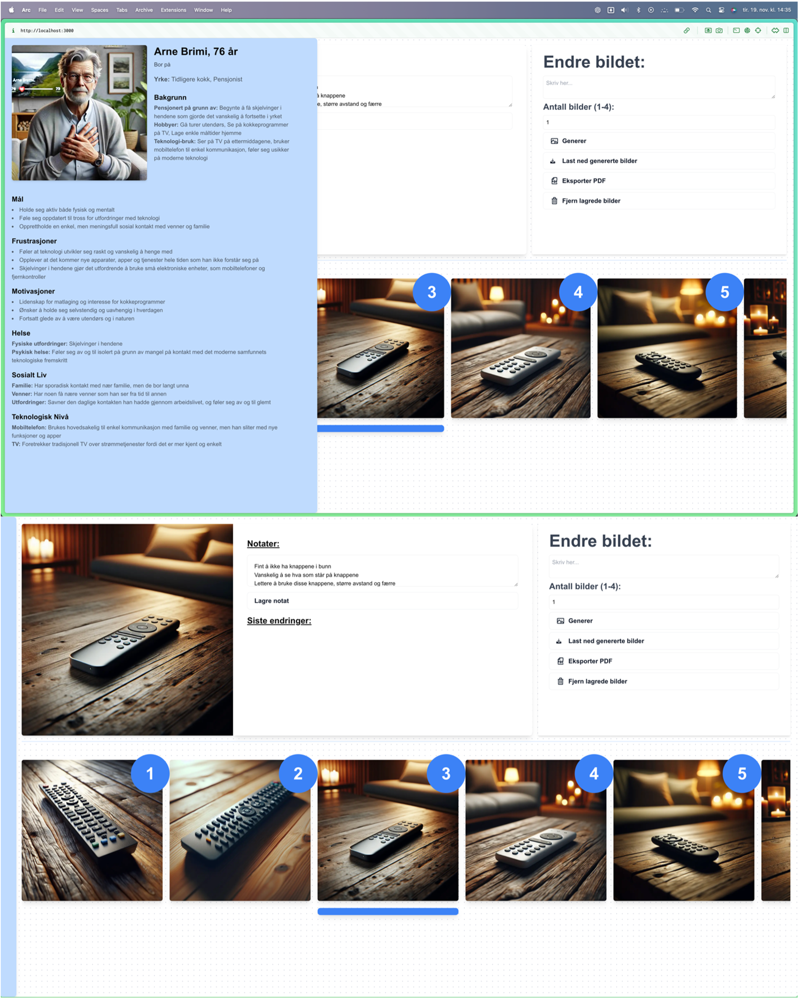
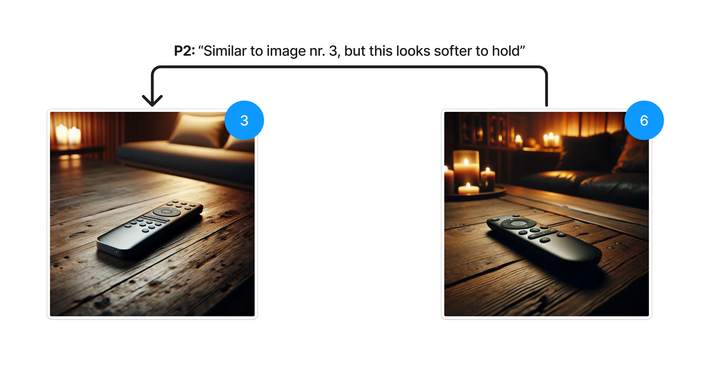

# IN3250 Project - Rapid Iteration

## Setup

### Install dependencies

**Open terminal and run the following command:**

```bash
npm install
or
yarn install
or similar
```

### API KEY

**Create an .env.local file inn root directory**

**Inside the .env.local file, add your OpenAI key:**

```
NEXT_PUBLIC_API_KEY=YOUR_API_KEY_HERE
```

#### Running the webpage

**Run project with the following command:**

```
npm run dev
```

### Illustrations

#### Interface



#### Feedback



#### GIF (early version)


#### Remote Control Experiment


